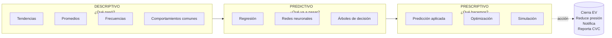
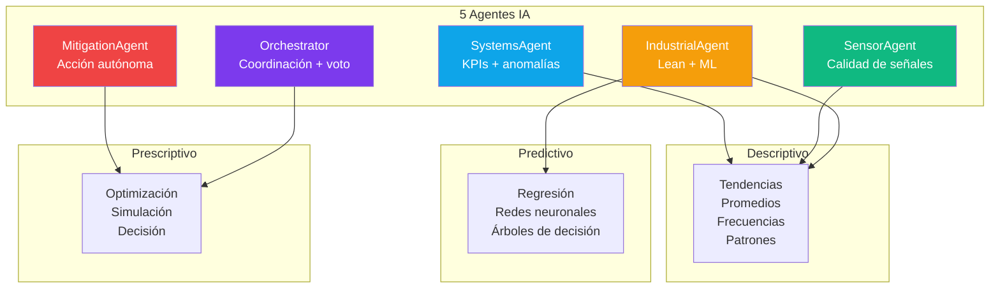
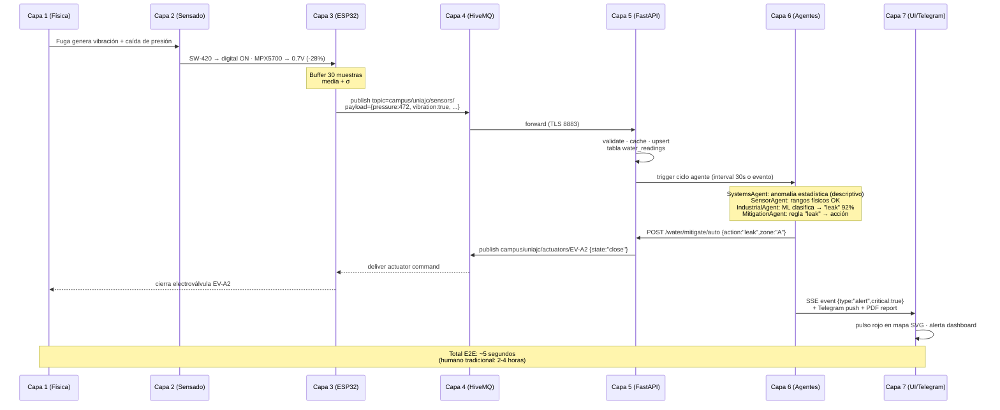
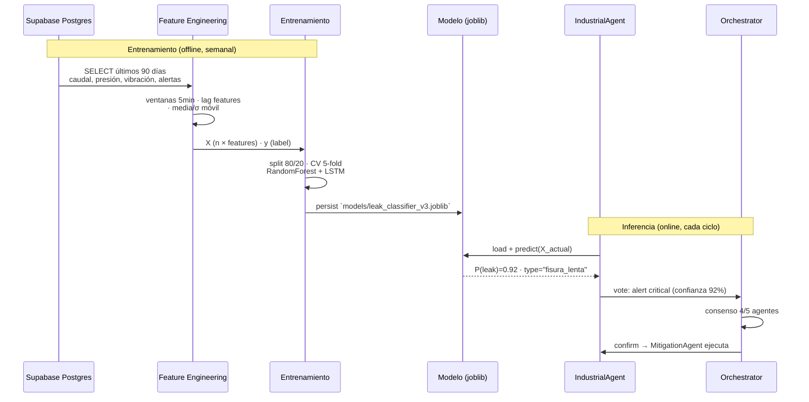
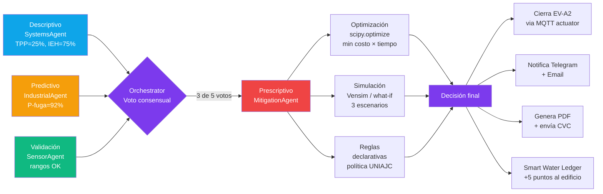

# WaterMind OS — Análisis Inteligente y Arquitectura por Capas

> **Para qué sirve este documento.** Responde dos preguntas que el jurado va a hacer:
> 1. *"¿Qué TIPO de análisis hace cada agente?"* → la trinidad analítica (sección 1).
> 2. *"¿Cómo se conecta TODO, desde el sensor en la PTAP hasta el botón del dashboard?"* → arquitectura de 7 capas con diagramas (secciones 2-3).
>
> Hackathon UNIAJC 2026 · Facultad de Ingeniería · 7-8 de mayo
> Versión post-asesoría jurados · v1.0

---

## Tabla de contenido

1. [La trinidad analítica de WaterMind](#1-la-trinidad-analítica-de-watermind)
  - 1.1 Análisis Descriptivo
  - 1.2 Análisis Predictivo
  - 1.3 Análisis Prescriptivo
  - 1.4 Mapa: qué agente hace qué tipo de análisis
2. [Arquitectura de 7 capas](#2-arquitectura-de-7-capas)
  - 2.1 Diagrama global (Mermaid)
  - 2.2 Diagrama global (ASCII)
  - 2.3 Detalle de cada capa
3. [Cómo se conectan las capas](#3-cómo-se-conectan-las-capas)
  - 3.1 Flujo end-to-end (sensor → acción)
  - 3.2 Flujo del análisis predictivo
  - 3.3 Flujo del análisis prescriptivo
4. [Mapa: análisis × capas](#4-mapa-análisis--capas)

---

## 1. La trinidad analítica de WaterMind

> *Un solo agente respondería "hay un problema". WaterMind responde tres preguntas: **qué pasó, qué va a pasar, qué hacemos**.*



### 1.1 Análisis Descriptivo — *"¿Qué pasó?"*

**Objetivo:** caracterizar el sistema hídrico con base en datos crudos. Es la base sobre la que todo lo demás se construye.

| Técnica | Implementación WaterMind | Ejemplo concreto |
|---------|--------------------------|-------------------|
| **Tendencias** | Series temporales por sensor (caudal, presión, nivel) — ventana móvil 24 h | "El consumo del Bloque A creció 12% mes a mes desde marzo" |
| **Promedios** | Media, mediana, desviación estándar, p50/p95/p99 por hora del día | "La presión nocturna promedio es 38 PSI ± 4" |
| **Frecuencias** | Histograma de eventos: vibración, alertas, cierres de EV | "El 73% de los eventos de fuga ocurren entre 22:00 y 06:00" |
| **Comportamientos comunes** | Patrones por hora/día/edificio (heatmaps) | "Los lunes a las 7 AM hay un pico de demanda 2.3× sobre el resto de la semana" |

**Tecnología:** `pandas` + `numpy` + `scipy.stats` en `packages/data` y `packages/ml`. **Quién lo ejecuta:** `SystemsAgent` cada 30 s (ciclo de monitoreo), publica los resultados en el dashboard como KPIs.

### 1.2 Análisis Predictivo — *"¿Qué va a pasar?"*

**Objetivo:** anticiparse a un problema usando los patrones aprendidos del histórico.

| Técnica | Implementación WaterMind | Ejemplo concreto |
|---------|--------------------------|-------------------|
| **Regresión** | Lineal y Ridge para demanda diaria; ARIMA/Prophet para series temporales con estacionalidad | "Mañana entre 7-9 AM se proyecta demanda de 1,800 L/min ± 120" |
| **Redes neuronales** | LSTM ligero (~50K params, CPU) para anomalías multivariadas (caudal + presión + vibración) | "Combinación de presión 28% baja + vibración SW-420 + caudal estable → 92% prob. de fuga oculta" |
| **Árboles de decisión** | Random Forest para clasificar tipo de fuga (rotura mayor / fisura lenta / mal cierre EV / sobrecarga) | "El patrón coincide con `fisura_lenta`: alerta amarilla, no cierre automático" |

**Tecnología:** `scikit-learn` (Random Forest, IsolationForest, regresiones), `tensorflow-lite` para LSTM en producción. Implementación en `packages/ml/agentos_ml/anomalies.py` y `packages/ml/agentos_ml/forecast.py`. **Quién lo ejecuta:** `IndustrialAgent` cuando `SystemsAgent` detecta una desviación que no encaja en ningún umbral simple.

### 1.3 Análisis Prescriptivo — *"¿Qué hacemos?"*

**Objetivo:** dado lo que pasó (descriptivo) y lo que va a pasar (predictivo), **decidir y ejecutar la mejor acción**.

| Técnica | Implementación WaterMind | Ejemplo concreto |
|---------|--------------------------|-------------------|
| **Predicción aplicada** | Toma las salidas predictivas y las traduce en una decisión accionable con triple validación (3 de 5 agentes deben coincidir) | "Pred. fuga 92% + costo evitado $14,500 L → acción `leak_response`" |
| **Optimización** | Programación lineal para schedule de bombeo (minimizar kWh × tarifa horaria); reglas para apertura/cierre de EV-RC1 según humedad de suelo | "Bombear 22:00-06:00 a 25 PSI ahorra 40% energía sin afectar nivel de tanque A" |
| **Simulación** | Escenarios "what-if" con el modelo Vensim (tesis Aristizábal & Largacha 2025): ¿qué pasa si baja cooperación al 0%, 15%, 50%? | "Cooperación 0% → colapso en 2 años. WaterMind activa campaña Smart Water Ledger" |

**Tecnología:** reglas declarativas + `scipy.optimize` + integración Vensim PySD. Implementación en `packages/agents/agentos_agents/nodes/mitigation.py` y `services/api/app/routers/mitigation.py`. **Quién lo ejecuta:** `MitigationAgent`, coordinado por `Orchestrator`.

### 1.4 Mapa: qué agente hace qué tipo de análisis



| Agente | Descriptivo | Predictivo | Prescriptivo |
|--------|:----------:|:----------:|:------------:|
| **Orchestrator** | — | — |  (voto consensual) |
| **SystemsAgent** |  KPIs (IEH, TPP, CPE, ICA) + IsolationForest | — | — |
| **SensorAgent** |  validación de rangos físicos + drift detection | — | — |
| **IndustrialAgent** |  análisis Lean (7 mudas) + Ishikawa |  Random Forest + ARIMA | — |
| **MitigationAgent** | — | — |  optimización + simulación + ejecución |

---

## 2. Arquitectura de 7 capas

> *De abajo hacia arriba: del agua física hasta el botón en el dashboard. Cada capa tiene una responsabilidad clara y un borde técnico explícito (interfaz, protocolo, formato de datos).*

### 2.1 Diagrama global — Mermaid (renderiza en GitHub)

```mermaid
flowchart TB
  subgraph L7["  CAPA 7 — APLICACIÓN<br/>Dashboard + Bot + Reportes"]
  L7A[SvelteKit /agua<br/>4 tabs · dark mode]
  L7B[Bot Telegram<br/>10 comandos]
  L7C[Reportes PDF<br/>WeasyPrint + Jinja2]
  L7D[Modelo 3D<br/>Three.js / SVG]
  end

  subgraph L6["  CAPA 6 — INTELIGENCIA<br/>5 Agentes IA + LangGraph"]
  L6A[Orchestrator]
  L6B[Systems · Sensor · Industrial · Mitigation]
  L6C[LLM Cascade<br/>Groq → OpenRouter → Gemini]
  end

  subgraph L5["  CAPA 5 — PERSISTENCIA<br/>FastAPI + DB"]
  L5A[FastAPI<br/>/water/* endpoints]
  L5B[Cache RAM<br/>Última hora]
  L5C[Supabase Postgres<br/>+ pgvector + PostGIS]
  L5D[Cold storage<br/>Parquet trimestral]
  end

  subgraph L4["  CAPA 4 — COMUNICACIÓN<br/>MQTT + HTTP fallback"]
  L4A[HiveMQ Cloud<br/>TLS 8883 · QoS 1]
  L4B[HTTP REST<br/>fallback]
  L4C[NVS local<br/>1000 lecturas]
  end

  subgraph L3["  CAPA 3 — EDGE / EMBEBIDA<br/>ESP32 + buffer + filtros"]
  L3A[ESP32-WROOM<br/>240 MHz dual-core]
  L3B[ADS1115 ADC 16-bit]
  L3C[Buffer circular RAM<br/>30 muestras]
  L3D[Acondicionamiento<br/>divisores + shunt]
  end

  subgraph L2["  CAPA 2 — SENSADO<br/>6 sensores físicos"]
  L2A[YF-S201<br/>Caudal]
  L2B[MPX5700AP<br/>Presión]
  L2C[JSN-SR04T<br/>Nivel tanque]
  L2D[SW-420<br/>Vibración]
  L2E[4-20mA<br/>Nivel freático]
  L2F[TSD-10<br/>Turbidez]
  end

  subgraph L1["  CAPA 1 — FÍSICA<br/>Campus UNIAJC Sede Sur"]
  L1A[Aljibes 1 y 2]
  L1B[PTAP 2011<br/>3 filtros + cloración]
  L1C[Tanques A 36k L<br/>+ B 16k L]
  L1D[6 edificios<br/>+ PTAR + Río Pance]
  end

  L1 ==> L2
  L2 ==> L3
  L3 ==> L4
  L4 ==> L5
  L5 ==> L6
  L6 ==> L7
  L7 -.acción.-> L4

  style L1 fill:#0c4a6e,color:#fff
  style L2 fill:#075985,color:#fff
  style L3 fill:#0369a1,color:#fff
  style L4 fill:#0284c7,color:#fff
  style L5 fill:#0ea5e9,color:#fff
  style L6 fill:#38bdf8,color:#000
  style L7 fill:#7dd3fc,color:#000
```



### 2.2 Diagrama global — ASCII (lectura en terminal/PDF)

```
╔══════════════════════════════════════════════════════════════════════════════════╗
║  ║
║  CAPA 7 — APLICACIÓN  ║
║  ┌────────────────┐  ┌────────────────┐  ┌────────────────┐  ┌────────────────┐ ║
║  │  SvelteKit  │  │  Bot Telegram  │  │  PDF Reports  │  │  Modelo 3D  │ ║
║  │  /agua (4 tabs)│  │  10 comandos  │  │  WeasyPrint  │  │  Three.js / SVG│ ║
║  └────────┬───────┘  └────────┬───────┘  └────────┬───────┘  └────────┬───────┘ ║
║  └──────────────┬────┴──────────┬────────┘  │  ║
║  │ HTTPS+SSE  │ HTTPS  │ Lazy  ║
╠═══════════════════════════│═══════════════│════════════════════════════│═════════╣
║  CAPA 6 — INTELIGENCIA  │  │  │  ║
║  ▼  ▼  ▼  ║
║  ┌──────────────────────────────────────────────────────────────────────────┐  ║
║  │  Orchestrator (LangGraph)  │  ║
║  │  │  │  ║
║  │  ┌────────┬──────────┬────┴────┬──────────┬───────────┐  │  ║
║  │  ▼  ▼  ▼  ▼  ▼  ▼  │  ║
║  │  Systems  Sensor  Industrial  Mitigation  LLM Cascade  Voto consensual  │  ║
║  │  (KPIs)  (señal)  (Lean+ML)  (acción)  Groq→OR→Gemini  3 de 5 OK  │  ║
║  └─────────────────────────────────┬─────────────────────────────────────────┘  ║
╠═════════════════════════════════════│════════════════════════════════════════════╣
║  CAPA 5 — PERSISTENCIA  │  ║
║  ▼  ║
║  ┌──────────────────────────────────────────────────────────────────────────┐  ║
║  │  FastAPI · /water/ingest · /water/reading · /water/agent/* · /reports  │  ║
║  │  │  │  ║
║  │  ┌─────┼─────────────────┐  ┌──────────────────┐  │  ║
║  │  ▼  ▼  ▼  ▼  ▼  │  ║
║  │  Cache RAM  Supabase Postgres  pgvector RAG  Parquet S3 (90d→5y)  │  ║
║  │  (última hora)  (90 días)  (embeddings)  (cold storage)  │  ║
║  └─────────────────────────────────┬─────────────────────────────────────────┘  ║
╠═════════════════════════════════════│════════════════════════════════════════════╣
║  CAPA 4 — COMUNICACIÓN  │  ║
║  ▲  ║
║  ┌─────────────────────────────────┴────────────────────────────────────────┐  ║
║  │  HiveMQ Cloud  ◀──MQTT 8883 TLS QoS 1──┐  │  ║
║  │  │  │  ║
║  │  HTTP REST fallback ◀───POST /water/ingest  │  ║
║  │  │  │  ║
║  │  NVS local (ESP32 flash) ────buffer 1000 lecturas si no hay internet  │  ║
║  └──────────────────────────────────────────┬───────────────────────────────┘  ║
╠══════════════════════════════════════════════│═══════════════════════════════════╣
║  CAPA 3 — EDGE / EMBEBIDA  │  ║
║  ▲  ║
║  ┌──────────────────────────────────────────┴───────────────────────────────┐  ║
║  │  ESP32-WROOM-32  (240 MHz dual-core · WiFi · 520 KB RAM · 4 MB flash)  │  ║
║  │  │  ║
║  │  Core 0 (1 Hz):  lee 6 sensores → media móvil N=10  │  ║
║  │  Core 1 (1/30s): promedio + min + max + σ → publica MQTT  │  ║
║  │  │  ║
║  │  ADS1115 ADC 16-bit I2C  ←  acondicionamiento (divisores, shunt 150Ω)  │  ║
║  └──────────────────────────────────────────┬───────────────────────────────┘  ║
╠══════════════════════════════════════════════│═══════════════════════════════════╣
║  CAPA 2 — SENSADO  │  ║
║  ▲  ║
║  ┌────────┬────────┬────────┬────────┬─────┴────┬────────┐  ║
║  │YF-S201 │MPX5700 │JSN-SR04│ SW-420 │ 4-20 mA  │ TSD-10 │  ║
║  │ Caudal │Presión │ Nivel  │Vibrac. │ Freático │Turbidez│  ║
║  │ ±2%  │ ±2.5%  │ ±1 cm  │ON/OFF  │ ±0.5% FS │±0.5 NTU│  ║
║  └────┬───┴────┬───┴────┬───┴────┬───┴────┬─────┴────┬───┘  ║
║  │  │  │  │  │  │  ║
╠════════│════════│════════│════════│════════│══════════│═════════════════════════╣
║  CAPA 1 — FÍSICA  ║
║  ▲  ▲  ▲  ▲  ▲  ▲  ║
║  ┌──────────────────────────────────────────────────────────────────────────┐  ║
║  │  Aljibes 1 y 2  →  PTAP 2011 (3 filtros + cloración)  →  Tanques A 36k L  │  ║
║  │  + B 16k L  │  ║
║  │  ↓  ↓  │  ║
║  │  Acuífero (Decreto 1076/2015)  6 edificios (Bloque A,  │  ║
║  │  Alameda, Cafetería, Labs,  │  ║
║  │  Cancha, Limpieza)  │  ║
║  │  ↓  │  ║
║  │  PTAR  →  Río Pance/Cauca  │  ║
║  │  (Res. 0631/2015)  │  ║
║  └──────────────────────────────────────────────────────────────────────────┘  ║
║  ║
╚══════════════════════════════════════════════════════════════════════════════════╝
```

### 2.3 Detalle de cada capa

| # | Capa | Responsabilidad | Borde de entrada | Borde de salida | Latencia |
|---|------|-----------------|------------------|-----------------|----------|
| 1 | **Física** | El recurso hídrico real (agua, tuberías, equipos UNIAJC) | — | Acoplamiento mecánico/eléctrico al sensor | — |
| 2 | **Sensado** | Convierte fenómeno físico en señal eléctrica | Acoplamiento mecánico (pulsos Hall, ultrasonido, presión) | Señal analógica 0-5V o digital | < 1 s |
| 3 | **Edge** | Filtra, promedia, almacena local | Señal analógica/digital | JSON estructurado | 1-30 s |
| 4 | **Comunicación** | Transporta al backend con garantías | JSON local | MQTT topic / HTTP POST | 30-100 ms |
| 5 | **Persistencia** | Valida, almacena, sirve API | MQTT/HTTP payload | REST/SSE response | 50-200 ms |
| 6 | **Inteligencia** | Analiza (3 niveles) y decide | Datos persistidos | Decisión + acción | 1-5 s |
| 7 | **Aplicación** | Visualiza, notifica, reporta | Datos + decisiones | Pantalla / mensaje / PDF | < 100 ms (UI) |

**E2E (sensor → cierre EV automática): 5–8 segundos** vs 2-4 horas manual.

---

## 3. Cómo se conectan las capas

### 3.1 Flujo end-to-end (sensor detecta fuga → cierre automático)



### 3.2 Flujo del análisis predictivo (entrenamiento + inferencia)



### 3.3 Flujo del análisis prescriptivo (decisión + acción)



---

## 4. Mapa: análisis × capas

> *Una vista cruzada que responde: "¿en qué capa vive cada tipo de análisis?"*

| Capa | Descriptivo | Predictivo | Prescriptivo |
|------|:-----------:|:----------:|:------------:|
| 7 · Aplicación | KPIs, gráficas, heatmaps en dashboard | "Mañana 7-9 AM: 1,800 L/min" en bot Telegram | Botón "ejecutar mitigación" + animación cierre EV |
| 6 · Inteligencia | SystemsAgent + SensorAgent + IndustrialAgent (parte ML descriptiva) | IndustrialAgent (RandomForest + LSTM + ARIMA) | Orchestrator + MitigationAgent (consenso + acción) |
| 5 · Persistencia | Queries SQL + materialized views (pandas) | Modelos persistidos en `models/*.joblib`, embeddings RAG | Tabla `mitigation_actions` con audit trail |
| 4 · Comunicación | — | — | MQTT publish a `actuators/*` topic |
| 3 · Edge | Buffer 30 s + media móvil + min/max/σ | LSTM tiny en TFLite (futuro Fase 4+) | Reglas locales: si presión < 25 PSI por 30 s, cerrar localmente |
| 2 · Sensado | Calibración 4 puntos + linealización | — | — |
| 1 · Física | — | — | Actuadores: 8 EV + 2 bombas + 1 dosificadora |

---

## Cierre

**Lo que esta arquitectura habilita** y que el jurado debe ver claro:

1. **Cada capa es independientemente reemplazable** — si HiveMQ cae, HTTP fallback. Si una bomba cambia de modelo, solo se actualiza la capa de sensado.
2. **Cada tipo de análisis vive en la capa que le corresponde** — no se mezcla pandas en el ESP32 ni reglas de negocio en Postgres.
3. **El borde entre capas es siempre un contrato explícito** — JSON con schema Pydantic, MQTT topic con QoS, REST con `{data, error, meta}`.
4. **La trinidad analítica responde las 3 preguntas que importan** — qué pasó (descriptivo), qué va a pasar (predictivo), qué hacemos (prescriptivo).

> *No medimos por medir. Caracterizamos para predecir, predecimos para decidir, decidimos para actuar.*

---

*Documento técnico v1.0 · Hackathon UNIAJC 2026 · Repositorio: github.com/JFrangel/WaterMind-OS*
